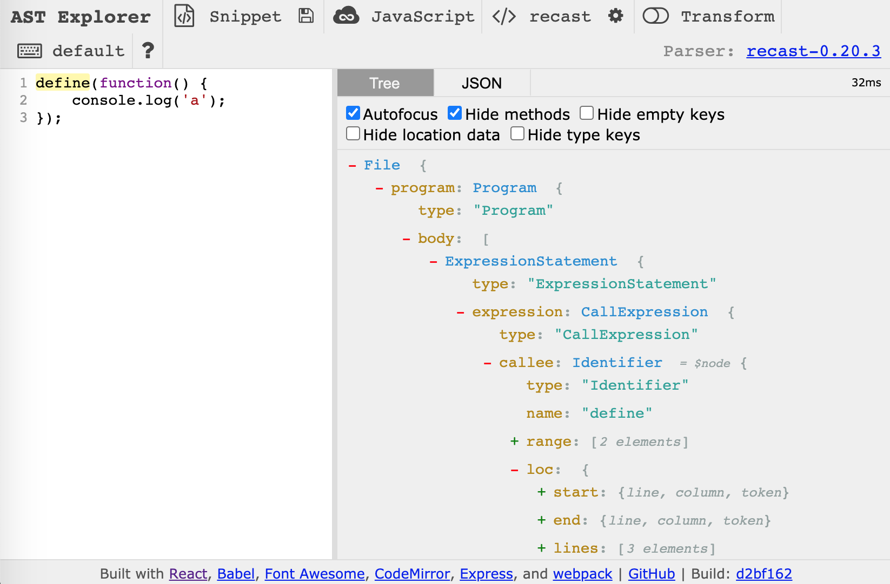

# Refactoring large codebases with AST-manipulations

Refactoring or converting a codebase from one framework or library to another can be quite the hassle. Especially if the codebase is big enough that it can't realistically be accomplished by hand. Luckily, the conversion process can often be automated. This article focuses on JavaScript, but the process can of course be done with other languages, by using different tools.

There may be many reasons for refactoring code. It could be to rename a certain parameter or a function-name used throughout the whole codebase. Or switching from one library to another. Basically, anything that makes the product or development experience better, or simply reduces the cognitive complexity of the code. While IDEs often have some refactoring capabilities, they just can't always cut it. Especially when it comes to JavaScript.

Throughout the article, a former project of mine will serve as the basis. The project of converting a codebase consisting of 4000+ JavaScript files from AMD to ES6 imports.

To convert that many files, a few different approaches can be taken. One could for example just craft a few scripts that, using regular-expressions, can substitute the right things. While that might work on very consistent codebases, you quickly stumble into weird corner-cases and strangely formatted files that cause the regular-expression to match the wrong things. Another approach, and the approach this article centers on, is AST-manipulations. AST is an abbreviation for Abstract Syntax Tree and is a tree representation of the code structure. I won't dive deeper into the theory and technicalities of AST seeing as the internet contains plenty of resources about the matter.

To manipulate the AST of a JavaScript file, several tools exist, but one of the better tools is "jscodeshift" <https://github.com/facebook/jscodeshift> which is a tool developed internally at Facebook. Jscodeshift enables the developer to write a codemod file, which can be applied to a whole codebase like this:

```
jscodeshift -t ./codemod.js <files>
```

To have a proper example to refer to throughout the rest of the article, I'm using <https://github.com/madskonradsen/amd-to-es6-codemod/> which is a codemod that is capable of converting an AMD-based codebase to ES6 imports.

> NB. The provided code only serves as an example and doesn’t handle all edge-cases. For a more battle-tested solution for AMD-to-ES6 conversion, consider <https://github.com/buxlabs/amd-to-es6>.

The code below is an excerpt from the example codemod mentioned before. Codemods are pure JavaScript and use the jscodeshift API to dictate how the AST should be restructured. Jscodeshift wraps a library called "recast" <https://github.com/benjamn/recast> which takes care of converting the JavaScript to AST, and printing it back out once we are done with the manipulations in our codemod.

```javascript
module.exports = function (file, api) {
  var j = api.jscodeshift;
  var root = j(file.source);

  root
    .find(j.CallExpression, { callee: { name: 'define' } }) // find require() function calls
    .filter(function (p) { return p.parentPath.parentPath.name === 'body'; })
    .forEach(function (p) {
      var body;

      ...

      // define(['a', 'b', 'c'], function(a, b, c) { });
      if (p.value.arguments.length === 2) {
        var props = p.value.arguments[0].elements;
        var comments = p.parent.value.comments || [];
        var importStatements = props.map(function (prop, i) {
          var moduleName = prop.value;
          var variableName = p.value.arguments[1].params[i] && p.value.arguments[1].params[i].name;
          return createImportStatement(j, moduleName, variableName);
        });

        // add the body after the import statements
        Array.prototype.push.apply(importStatements, p.value.arguments[1].body.body);

        ...

  return root.toSource({ quote: 'single' });

```

But how does one know how to refer to the correct nodes in the AST? This is where AST Explorer <https://astexplorer.net/> comes into play. AST Explorer allows us to copy/paste the code we want to convert, into their tool (Remember to choose the "recast" parser from the drop-down menu), and see the AST structure behind it. The overview of the AST-structure is what enables us to locate the AMD-"define"-calls in our example above.




```javascript
root
  .find(j.CallExpression, { callee: { name: 'define' } })
```

We then use the jscodeshift API to locate a CallExpression that have a callee with the name "define". When we have the reference to that call-expression, we can make additional checks such as the following:

```javascript
// define(['a', 'b', 'c'], function(a, b, c) { });
if (p.value.arguments.length === 2) {
```

Here we check whether the define-statements have any arguments, and in that case, our script has to handle those cases as well. When we are done with our modifications, we simply tell jscodeshift to convert it back to sourcecode:

```javascript
return root.toSource({ quote: 'single' });
```

As seen in the screenshot above, the AST is simply a JavaScript object, which means that it can be manipulated using basic JavaScript code.

## Strategies for performing the conversion
When performing the actual conversion, there are two different approaches to take. Either perform the conversion incremental or do a big-bang conversion where everything is converted at once. The incremental conversion would often be the safest approach seeing as it can be done slowly and without interfering too much with the rest of the development team. But sometimes it's not possible to do things incrementally. For example when converting a codebase from AMD to ES6. In such cases, the big-bang conversion is most likely the only possible solution.
Performing a big-bang conversion can be quite risky, as small bugs in the codemod can have big consequences for the rest of the development team. Therefore, preparation is key. To prepare for the conversion, one could create a script that performs all the necessary steps for the conversion. That would not only give the developer some peace of mind during the actual conversion but also allows the developer to run through all the steps over and over again until all tests are green.

Such a script could look like the following:
```bash
git reset --hard # To ensure a pristine working environment
git pull # Debatable seeing as we perhaps might want stability while working on the script
jscodeshift -t ./codemod.js <files>
git apply /path/to/some.patch # Might be necessary if you for example need to make changes to a Webpack-config 
webpack # Build
npm run test:unit
npm run test:integration
npm run test:e2e
echo "Done!"
```

## Final remarks

While the process of constructing codemods and getting them just right can be quite cumbersome, it often pays off. Especially in the case of AMD-to-ES6 which ultimately provides a better development experience, and brings the codebase closer to the JavaScript standards.
